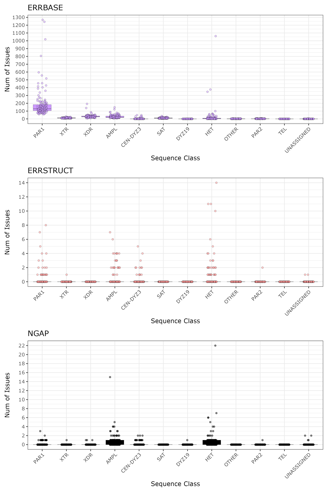
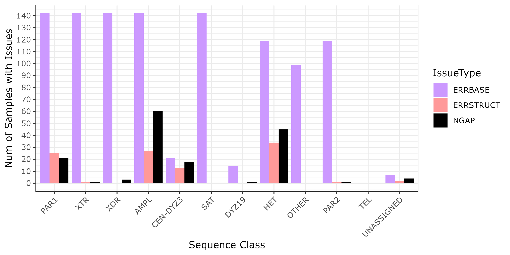
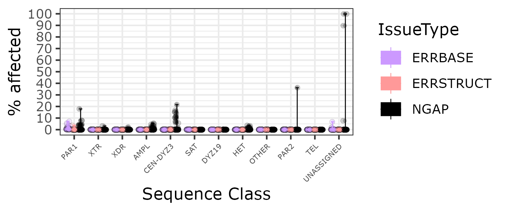
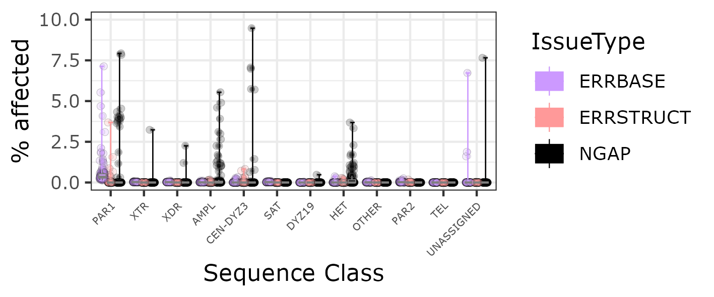
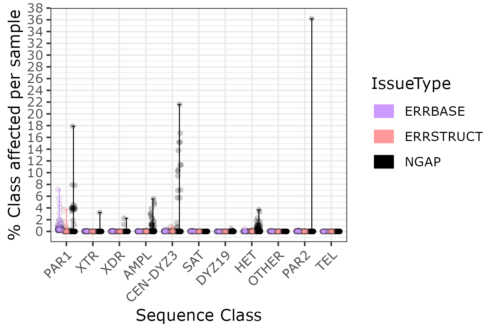
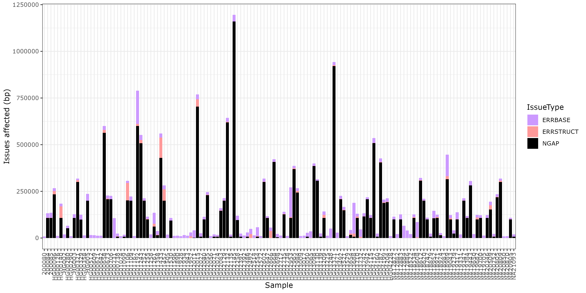
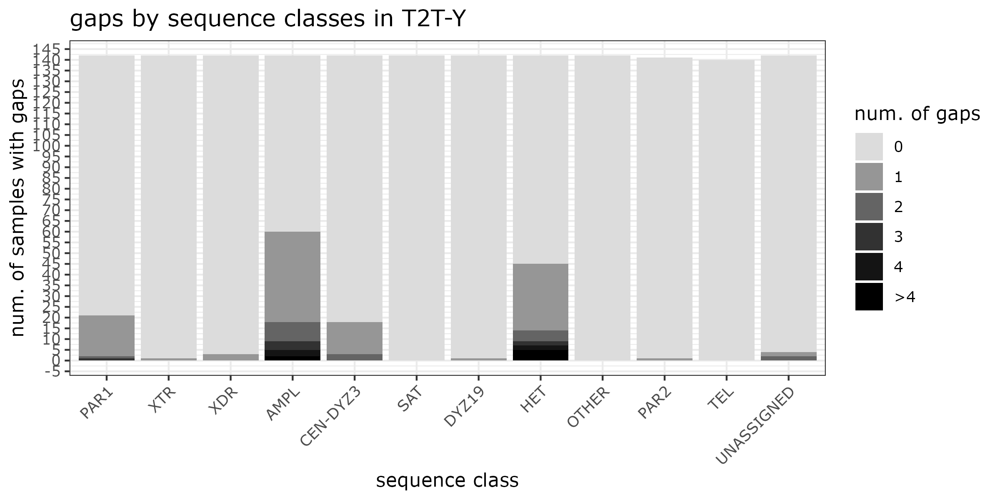
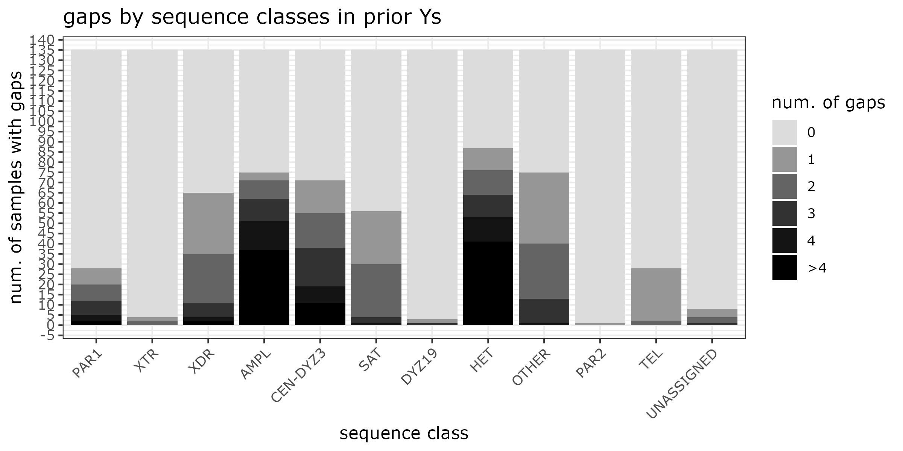
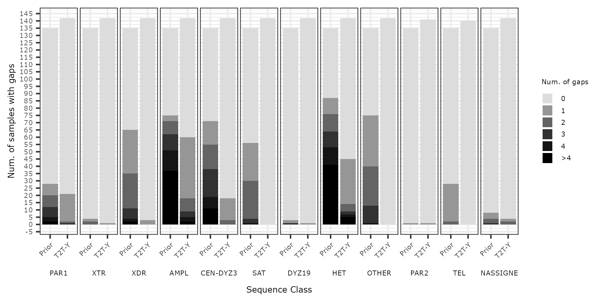

# Assembly issues

* Feedback from earlier attempts:
  * Merqury QV plot goes to SFig
  * Prior vs. T2T version assembly continuity comparison is not reflecting results as intended
  * Input file for plotting: `issue_counts_lengths_by_seqclass.nonoverlap.txt`

## Prototype

Per-sample; what type of issues are found in which sequence class annotation?

* Original bed: `/data/T2T-Y/globus/verkko-v2.2.1/annotations/seq_classes/2026-02_final-rev/patched/t2tv2/$sample.t2tv2.chrY-regions.hg38-patched.bed`
* Sequence Class bed: `../seqclass_ideogram/originY/$sample.seqclass.main.bed`
* Issues bed: `../seqclass_ideogram/issues/$sample.issues.main.bed`

```sh
./count_by_issues.sh
```

* Changed Issues bed to a non-overlapping version, prioritizing in the order of
  * NGAP
  * ERRSTRUCT
  * ERRBASE

So, e.g. any ERRBASE overlapping ERRSTRUCT will be removed.

* Issues bed: `../seqclass_ideogram/issues/$sample.issues.main.nonoverlap.bed`
```sh
# change input to $sample.issues.main.nonoverlap.bed
./count_by_issues.sh
```

## Plot figures

```sh
module load R/4.5.0
Rscript plot_issues.R
```

### 1. Plot number of issues by sequence class, faceted by issue type


### 2. Plot number of samples with issues by sequence class, faceted by issue type


### 3. Plot % IssueLength by sequence class, scaled to ClassLength


### 3-1. Zoomed-in to 0-20%


### 3-2. Remove UNASSIGNED
```sh
awk '$2=="UNASSIGNED" && $NF=="NGAP" && $3>0' issue_counts_lengths_by_seqclass.nonoverlap.txt
NA18534 UNASSIGNED      1       111427  100000  NGAP - PAR2
HG01243 UNASSIGNED      2       300416  300000  NGAP - AMPL (100000, 200000)
HG02602 UNASSIGNED      2       300445  300000  NGAP - AMPL (200029, 100000)
HG04157 UNASSIGNED      1       19592   1500    NGAP - PAR2
```



### 4. Issues in bps by samples



## Unplaced sequences
* How many samples have 1, 2, 3, 4, >4 NGAPs in each IssueType?
* Start use a new script

```sh
awk '$NF=="NGAP" || NR==1' issue_counts_lengths_by_seqclass.nonoverlap.txt | \
  awk -v OFS="\t" '{ if (NR>1 && $3>0) { if ($3>4) { $3=">4";} } print $0 }' \
  > issue_counts_lengths_by_seqclass.nonoverlap.gap.txt
```


## Prior assemblies using GQC
From Nancy:
Under `../y_comparison/GQC_AC/[HPRC,HGSVC,CEPH]/$sample/${sample}_oldY_vs_newY`
* `${sample}_oldY.genome.bed`: PriorY size
* `${sample}_newY.genome.bed`: T2T-Y size
* `${sample}_oldY_vs_${sample}_newY.refcovered.sort.bed`: T2T-Y covered

Make a bed file of regions where no prior-Y sequences break (gaps).
Ignore alignment gaps.

### Collect gaps in all samples
```sh
for sample in $(cat ../sample_fa.map | cut -f1);
do
  ./collect_gaps_in_prior.sh $sample
done
```

### Plot
```sh
module load R/4.5.0

echo -e "Sample\tSeqClass\tNumIssues" > gaps_in_prior_wi_0.txt
cat gaps_in_prior_wi_0/* | \
  awk -v OFS="\t" '{ if ($3>4) { $3=">4";} print $0 }' \
  >> gaps_in_prior_wi_0.txt

Rscript unplaced.R
```
T2T-Ys:


PriorBestYs:


In one plot:


## Where are the assembly gaps?

Make a table of
* sample name
* seclasses (num gaps)

For Table S6:

```sh
cat issue_counts_lengths_by_seqclass.nonoverlap.txt | \
  awk -v OFS="\t" -F "\t" '$NF=="NGAP" {print $0}' | \
  awk -v OFS="\t" -F "\t" 'BEGIN {sample="Sample"} {
    if ($1 != sample) {print sample, seqclasses; sample=$1; seqclasses=""}
    if ($3!=0) { seqclasses=seqclasses$2" ("$3"), " }
  } END {print sample, seqclasses;}' |\
  sed 's/, $//g' | sed 's/HET/Yq12/g' | sed 's/CEN-DYZ3/CEN/g' > T2TY_gaps_supptable.txt
```

Also for prior Ys:

```sh
cat gaps_in_prior_wi_0.txt | \
  awk -v OFS="\t" -F "\t" 'BEGIN {sample="Sample"} {
    if ($1 != sample) {print sample, seqclasses; sample=$1; seqclasses=""}
    if ($3!=0) { seqclasses=seqclasses$2" ("$3"), " }
  } END {print sample, seqclasses;}' |\
  sed 's/, $//g' | sed 's/HET/Yq12/g' | sed 's/CEN-DYZ3/CEN/g' > PriorY_gaps_supptable.txt
```
