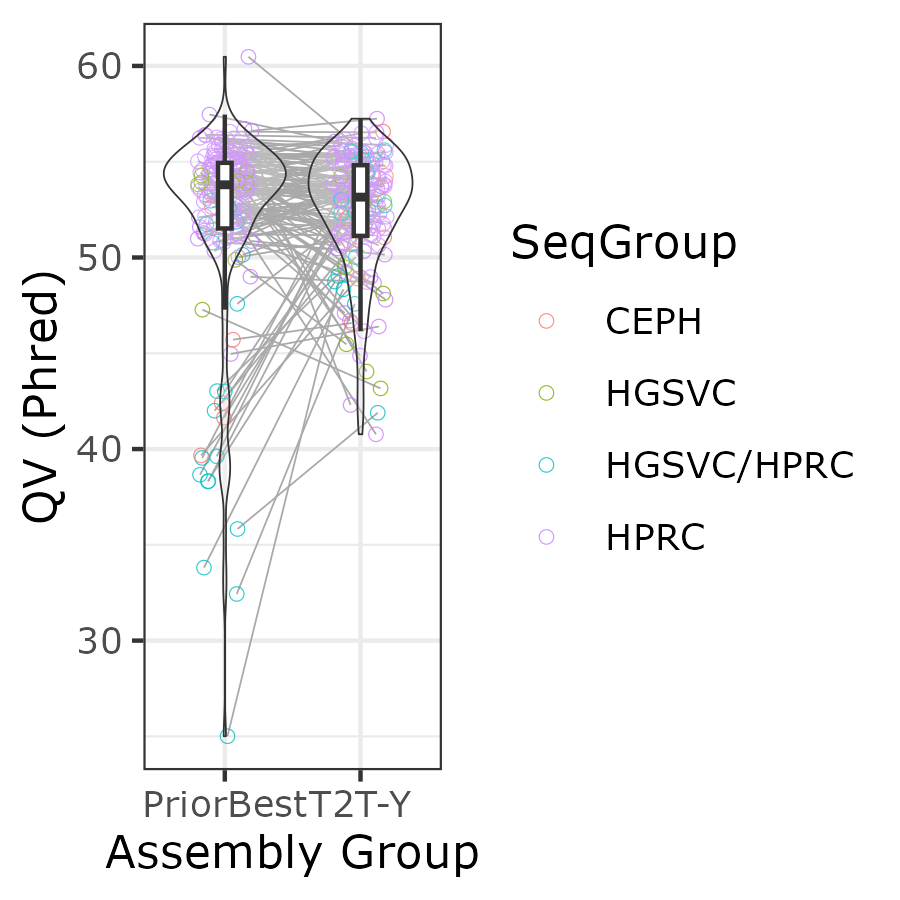
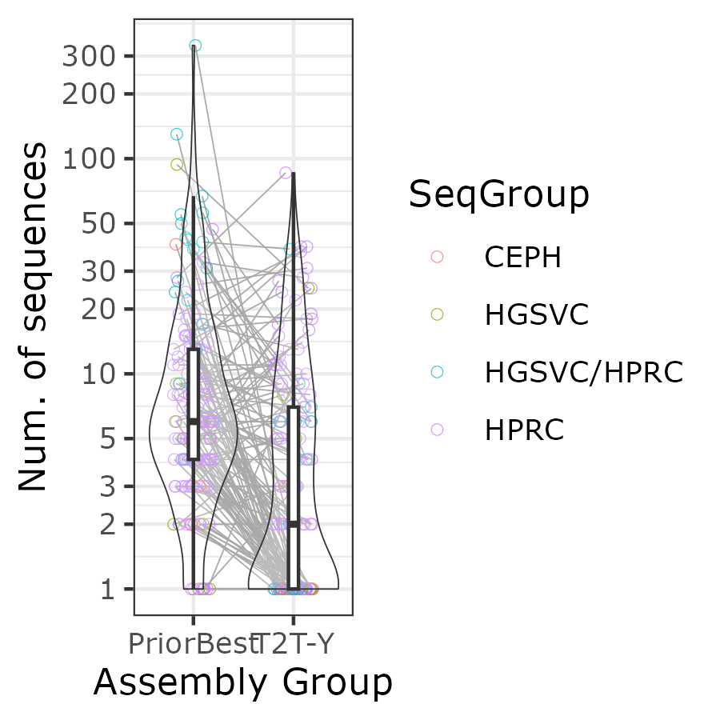
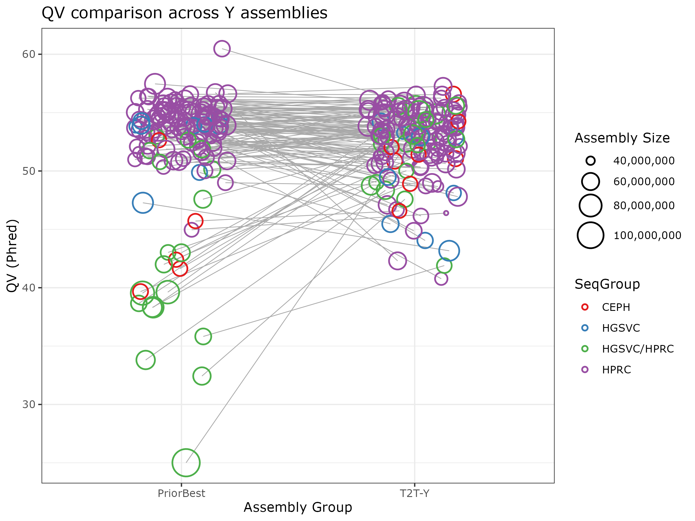
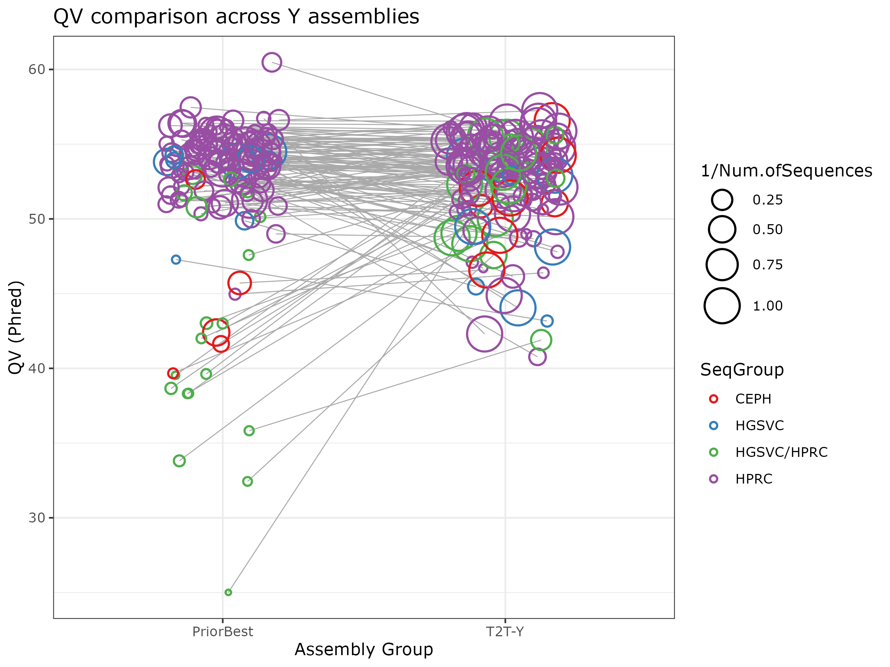
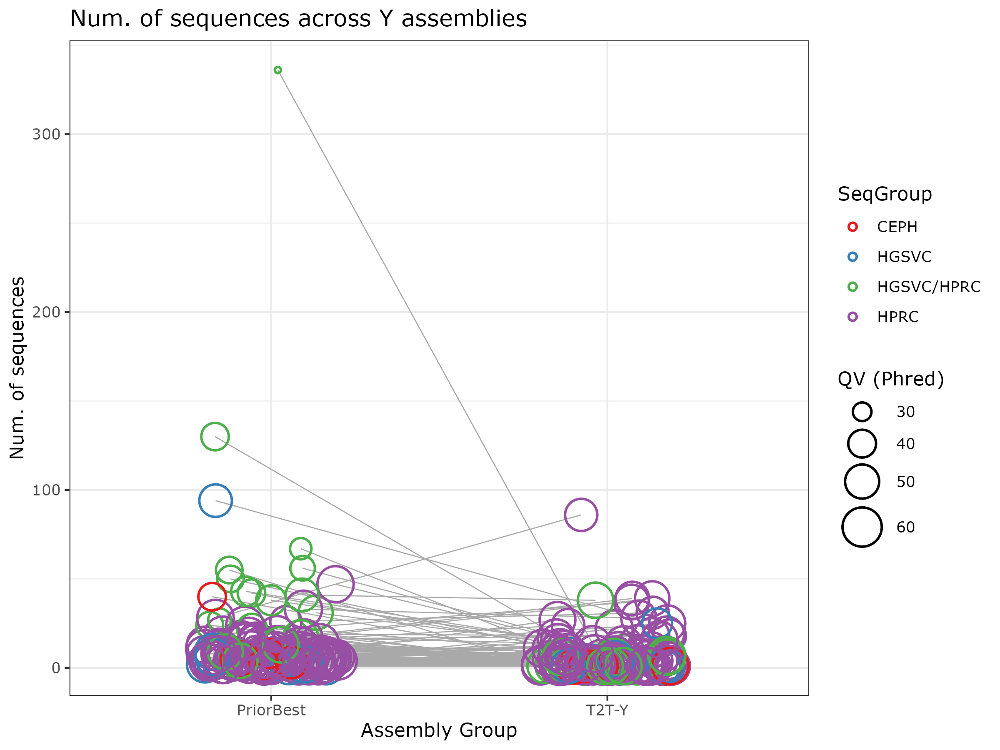
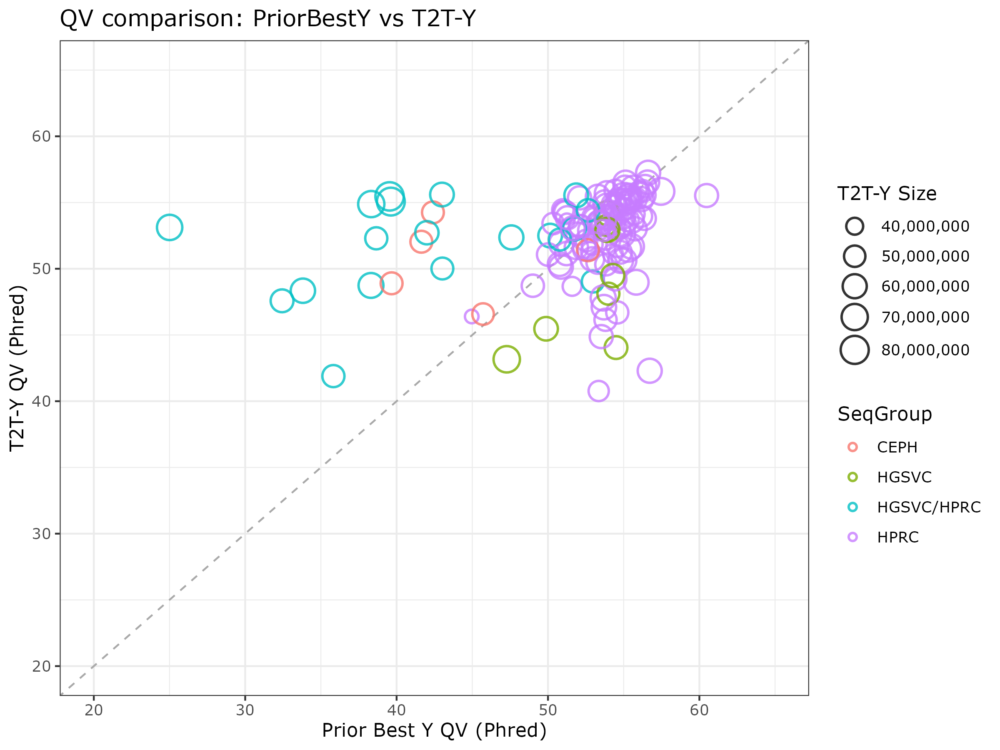

# QV of curated vs. hprc r2 Y assemblies

* `curatedY`: QV for the curated main and random Y sequences.
* `hprc_r2Y`: QV for the polished hprc Y assemblies, based on Nancy's alignment.
* `HGSVCv3` : QV for the prior best HGSVCv3 assemblies, assigned as Y (provided by Pille), from Logsdon et al. 2025
* `CEPH2025`: QV for the prior best CEPH assemblies, from Porubsky et al. 2025

QV has been obtained using Illumina NovaSeq6000 runs, using k=31 and Merqury.
* Illumina FASTQ files are under `/data/T2T-Y/illumina`
* 31-mer meryl dbs are under `/data/T2T-Y/meryl/`
* HPRC r2 release assemblies are under `/fdb/HPRC/r2/assemblies/`
* Curated Y assemblies are under `/data/T2T-Y/asm-annot/*/chrY_assemblies/`, where `*` is grouped by `hprc` `hgsvc` and `ceph`
* Prior best HGSVC and CEPH Y assemblies are under `/data/T2T-Y/globus/v1-b_draft_hgsvc3_2024/assemblies/hgsvc3_2024_fa.map`

For plotting, a master file with the following columns have been generated, named `qv_plot_input.tsv`:

  | Sample | AsmGroup | QV | NumSequences | TotalSize | SeqGroup |
  | ------ | -------- | --- | ----------- | --------- | -------- |

  * Sample: Sample ID
  * AsmGroup: PriorBest (HPRC_r2 / HG002Q100 / HGSVCv3 / CEPH2025) | CuratedY
  * QV: Merqury QV; 4th column of the QV file - includes all sequences, including unplaced
  * NumSequences: Num. of sequences that went into this Y
  * TotalSize: 3rd column from the QV file
  * SeqGroup: HPRC HGSVC HGSVC/HPRC CEPH GIAB

Notable samples
  * HG03456 (HGSVC) - excluded from the curated Y list due to its XYY karyotype
  * HG002 (HPRC_r2) - this is the Q100 version

Iinput files for plotting (after correcting HPRC/HGSVC topup samples): `qv_plot_input_fix_seqgroup.tsv` and `qv_plot_by_asmset_input_fixseqgroup.tsv`

Plotting script: `plot_qvs.R`

```sh
echo -e "Sample\tAsmGroup\tQV\tNumSequences\tTotalSize\tSeqGroup" > qv_plot_input.tsv

## CuratedY
curated_map=curatedY_fa_grp.map # 142 samples
for i in $(seq 1 142)
do
  ln=`sed -n ${i}p $curated_map`
  Sample=`echo $ln | awk '{print $1}'`
  AsmGroup="CuratedY"
  qv_file=curatedY/$Sample/$Sample.qv
  if [[ -s $qv_file ]]; then
    QV=`tail -n1 $qv_file | awk -F "\t" '{print $4}'`
    fai=`echo $ln | awk '{print $2}'`.fai
    NumSequences=`wc -l $fai | awk '{print $1}'`
    TotalSize=`tail -n1 $qv_file | awk -F "\t" '{print $3}'`
    SeqGroup=`echo $ln | awk '{print toupper($3)}'`
    echo -e "$Sample\t$AsmGroup\t$QV\t$NumSequences\t$TotalSize\t$SeqGroup" >> qv_plot_input.tsv
  else
    echo "QV not available for $Sample $AsmGroup"
  fi
done

## HPRC_r2
hprc_r2_map=hprc_r2_samples.list # 103 samples
for i in $(seq 1 103)
do
  ln=`sed -n ${i}p $hprc_r2_map`
  Sample=`echo $ln | awk '{print $1}'`
  AsmGroup="PriorBest"
  qv_file=hprc_r2Y/$Sample/$Sample.qv
  if [[ -s $qv_file ]]; then
    QV=`tail -n1 $qv_file | awk -F "\t" '{print $4}'`
    NumSequences=`wc -l hprc_r2Y/$Sample/*.list | tail -n1 | awk '{print $1}'`
    TotalSize=`tail -n1 $qv_file | awk -F "\t" '{print $3}'`
    SeqGroup="HPRC"
    #if [[ "$Sample" == "HG002" ]]; then
    #  SeqGroup="HG002Q100"
    #fi
    echo -e "$Sample\t$AsmGroup\t$QV\t$NumSequences\t$TotalSize\t$SeqGroup" >> qv_plot_input.tsv
  else
    echo "QV not available for $Sample $AsmGroup"
  fi
done

## add HGSVC and CEPH
hgsvc3_map=hgsvc3_2024_fa.map # 35 samples
for i in $(seq 1 35)
do
  ln=`sed -n ${i}p $hgsvc3_map`
  Sample=`echo $ln | awk '{print $1}'`
  AsmGroup="PriorBest"
  SeqGroup=`echo $ln | awk '{print toupper($3)}'`
  qv_file=hgsvc3/$Sample/$Sample.qv
  if [[ -s $qv_file ]]; then
    QV=`tail -n1 $qv_file | awk -F "\t" '{print $4}'`
    fai=`echo $ln | awk '{print $2}'`.fai
    NumSequences=`wc -l $fai | awk '{print $1}'`
    TotalSize=`tail -n1 $qv_file | awk -F "\t" '{print $3}'`
    echo -e "$Sample\t$AsmGroup\t$QV\t$NumSequences\t$TotalSize\t$SeqGroup" >> qv_plot_input.tsv
  else
    echo "QV not available for $Sample $AsmGroup"
  fi
done

wc -l qv_plot_input.tsv
# 279 qv_plot_input.tsv
# 142 CuratedY + 136 PriorBest; 6 only exists in CuratedY.

# Rename the 20 topped-up HGSVC samples to HGSVC/HPRC in SeqGroup and CuratedY as T2T-Y
awk 'BEGIN {OFS="\t"} FNR==NR { map[$1] = "HGSVC/HPRC"; next } \
    { if ($1 in map ) {$NF = map[$1];} print $0}' hgsvc_hprc_topup.list qv_plot_input.tsv | \
  awk -F "\t" 'BEGIN {OFS="\t"} {if ($2=="CuratedY") { $2="T2T-Y"; } print $0}' > qv_plot_input_fix_seqgroup.tsv

```

Plot
```sh
Rscript plot_qvs.R # use qv_plot_input_fix_seqgroup.tsv
```






```
    Sample              AsmGroup         QV        NumSequences     TotalSize          SeqGroup        
 Length:103         HPRC_r2 :103   Min.   :45.0   Min.   : 1.00   Min.   :38169581   Length:103        
 Class :character   CuratedY:  0   1st Qu.:52.9   1st Qu.: 4.00   1st Qu.:52131951   Class :character  
 Mode  :character                  Median :54.4   Median : 6.00   Median :55256077   Mode  :character  
                                   Mean   :53.9   Mean   : 7.84   Mean   :55667913                     
                                   3rd Qu.:55.2   3rd Qu.:10.00   3rd Qu.:59010976                     
                                   Max.   :60.5   Max.   :47.00   Max.   :75049887                     

    Sample              AsmGroup         QV        NumSequences     TotalSize          SeqGroup        
 Length:142         HPRC_r2 :  0   Min.   :40.8   Min.   : 1.00   Min.   :37726115   Length:142        
 Class :character   CuratedY:142   1st Qu.:51.1   1st Qu.: 1.00   1st Qu.:52233512   Class :character  
 Mode  :character                  Median :53.2   Median : 2.00   Median :55647917   Mode  :character  
                                   Mean   :52.4   Mean   : 6.63   Mean   :56716843                     
                                   3rd Qu.:54.8   3rd Qu.: 7.00   3rd Qu.:59851294                     
                                   Max.   :57.2   Max.   :86.00   Max.   :81719864     

[1] "Standard Deviation of HPRC_r2 QV:"
[1] 2.033743
[1] "Standard Deviation of CuratedY QV:"
[1] 3.22083
 ```

## QV comparison between samples in both sets

This time, we want to compare QVs of the same sample that was assembled in each set.
The input format for plotting:
* Sample
* CuratedYQV - QV value
* CuratedYSize
* PriorBestYQV - QV value
* PriorBestYSize

```sh
for sample in $(cat samples_hprc.list)
do
  if [[ -s hprc_r2Y/$sample/$sample.qv ]]; then
    echo $sample >> samples_in_both.list
  fi
done

echo -e "Sample\tSeqGroup\tCuratedYQV\tCuratedYSize\tPriorBestYQV\tPriorBestYSize" > qv_plot_by_asmset_input.tsv
awk '$2=="CuratedY" {print $1"\t"$NF"\t"$3"\t"$5}' qv_plot_input.tsv | sort -k1,1 > curated_qv.txt
awk '$2=="PriorBest"  {print $1"\t"$3"\t"$5}' qv_plot_input.tsv | sort -k1,1 > priorbest_qv.txt
join --nocheck-order curated_qv.txt priorbest_qv.txt | tr ' ' '\t' >> qv_plot_by_asmset_input.tsv

qv_plot_by_asmset_input.tsv
# 137 qv_plot_by_asmset_input.tsv
Rscript plot_qvs.R
```
* Replace the 20 HPRC top-up samples with HGSVC/HPRC
```sh
awk 'BEGIN {OFS="\t"} FNR==NR { map[$1] = "HGSVC/HPRC"; next } \
    { if ($1 in map ) {$2 = map[$1];} print $0}' hgsvc_hprc_topup.list qv_plot_by_asmset_input.tsv > qv_plot_by_asmset_input_fixseqgroup.tsv

# Add Ys that did not have a prior best
cut -f1 priorbest_qv.txt > priorbest_qv.list
java -jar -Xmx256m ~/codes/txtGrepv.jar priorbest_qv.list curated_qv.txt 1 > curated_qv.no_prior.txt

# Sanity check
wc -l curated_qv.no_prior.txt
# 6 curated_qv.no_prior.txt
cat curated_qv.no_prior.txt | awk -F "\t" -OFS="\t" '{print $0"\tNA\tNA"}' >> qv_plot_by_asmset_input_fixseqgroup.tsv
Rscript plot_qvs.R
```





