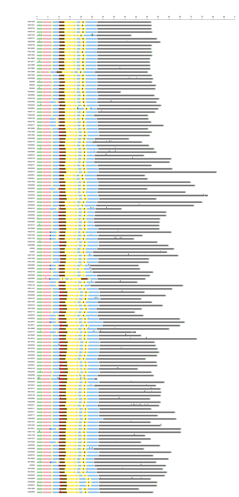

# Sequence class annotation

* Updated on Apr 2, 2026
* Input files: `/data/T2T-Y/globus/verkko-v2.2.1/annotations/seq_classes/2026-02_final-rev/patched/t2tv2` from Peter Ebert
  ```
  ... the sequence class annotations are now "patched" with the respective other reference labeling and stitched in one go. There are very few UNASSIGNED regions left, but typically only very short ones (i.e., I kept the region boundary set by the aligner intact, @Pille Hallast)
  ```

* NGAP: in this version, I stitched regions together also over NGAPS, so they should all be labeled by the region they appear in, e.g.:
  ```
  NA19443_chrY    52047081        52121791        NGAP    0       +       ISSUE   HET     HET
  
  HG04199_chrY    1295789 1295849 ERRBASE 0       +       ISSUE   PAR1    PAR
  HG04199_chrY    1296000 1296244 ERRSTRUCT       0       +       ISSUE   PAR1    PAR
  HG04199_chrY    1296244 1396244 NGAP    0       +       ISSUE   PAR1    PAR
  HG04199_chrY    1396244 1396302 ERRBASE 0       +       ISSUE   PAR1    PAR
  ```
* PAR1/PAR2 should (hopefully) be fully extended to beginning/end even if there is no telomere
* overlaps between umbrella labels were evenly broken unless one of the partners was an AMPL* region, then only that one was changed
* some other "tweaks" were done mostly to deal with the edge cases, e.g. discarding very small regions, typically PAR2 contamination in PAR1

## See what's in the stiched bed

```sh
test_bed=/data/T2T-Y/globus/verkko-v2.2.1/annotations/seq_classes/2026-02_final-rev/patched/t2tv2/HG02647.t2tv2.chrY-regions.hg38-patched.bed
head $test_bed
#seq    start   end     label   score   strand  category        assign_label    assign_group
HG02647_chrY    0       8868    TELOp   1000    +       LABEL   TELOp   TEL
HG02647_chrY    8868    2584167 PAR1    1000    +       LABEL   PAR1    PAR
HG02647_chrY    17388   17427   ERRBASE 0       +       ISSUE   PAR1    PAR
HG02647_chrY    82196   82232   ERRBASE 0       +       ISSUE   PAR1    PAR
HG02647_chrY    171261  171342  ERRBASE 0       +       ISSUE   PAR1    PAR
HG02647_chrY    171384  171502  ERRBASE 0       +       ISSUE   PAR1    PAR
HG02647_chrY    171753  172021  ERRBASE 0       +       ISSUE   PAR1    PAR
HG02647_chrY    182577  182766  ERRBASE 0       +       ISSUE   PAR1    PAR
HG02647_chrY    182786  182817  ERRBASE 0       +       ISSUE   PAR1    PAR
```

```sh
cat $test_bed | awk '{print $NF}' | sort -u
cat /data/T2T-Y/globus/verkko-v2.2.1/annotations/seq_classes/2026-02_final-rev/patched/t2tv2/*.bed | awk '$(NF-2)=="LABEL" {print $NF}' | sort -u
AMPL
CEN-DYZ3
DYZ19
HET
OTH
PAR
SAT
TEL
UNASSIGNED
XDR
XTR
```

## Format and extract main / random sequence classes

The final files will have the sequence class in the 4th column:
* AMPL
* CEN-DYZ3
* DYZ19
* HET
* OTH
* PAR1
* PAR2
* SAT
* TEL
* UNASSIGNED
* XDR
* XTR

```sh
./seqclass.sh
```
Output files:
* `originY/`
  * `$sample.seqclass.bed` : has all region
  * `$sample.seqclass.main.bed` : has only the main _chrY sequence
  * `$sample.seqclass.random.bed` : has only the unplaced sequence
* `chrY/$sample.seqclass.main.bed`: has only the main Y on the chrY coordinate

## Issues by category

```sh
cat $test_bed | awk '$(NF-2)=="ISSUE" {print $4}' | sort -u
cat /data/T2T-Y/globus/verkko-v2.2.1/annotations/seq_classes/2026-02_final-rev/patched/t2tv2/*.bed | awk '$(NF-2)=="ISSUE" {print $4}' | sort -u
```
Types of errors:
* ERRBASE
* ERRSTRUCT
* NGAP

```sh
./issues.sh
```

Output files:
* `issues/`
  * `$sample.issues.bed` : has all region
  * `$sample.issues.main.bed` : has only the main _chrY sequence
  * `$sample.issues.main.nonoverlap.bed` : has non-overlapping issues (NGAP > ERRSTRUCT > ERRBASE)
  * `$sample.issues.random.bed` : has only the unplaced sequence
* `chrY/$sample.issues.main.bed`: has only the main Y on chrY coordinate
* `chr1/$sample.issues.main.bed`: has only the main Y on chr1 coordinate

## Visualization

### On IGV
* Load CHM13v2 as the "Genome"; see https://github.com/arangrhie/T2T-HG002Y/tree/main/igv_sessions
* Open Session `main_seqclass.xml`

Some Y chromosomes are longer than that of HG002Y; make the seq as chr1 for visualization and rename HET to Yq12, CEN-DYZ3 to CEN:
```sh
for bed in $(ls chrY/*.seqclass.main.bed )
do
  sample=`basename ${bed} | awk -F '.' '{print $1}'`
  cat chrY/$sample.seqclass.main.bed | sed 's/chrY/chr1/g' | sed 's/HET/Yq12/g' | sed 's/CEN-DYZ3/CEN/g' > chr1/$sample.seqclass.main.bed
  cat chrY/$sample.issues.main.bed | sed 's/chrY/chr1/g' | sed 's/HET/Yq12/g' | sed 's/CEN-DYZ3/CEN/g' > chr1/$sample.issues.main.bed
done
```

### For Supp. Fig 2
Plotting
```sh
module load R/4.5.2
Rscript plot_ideogram.R
```

Output: `seqclass_ideogram.pdf` and `seqclass_ideogram.png`


* Potential `AMPL` and `PAR2` marked as UNASSIGNED:
  ```
  NA18534 UNASSIGNED 1 111427 100000 NGAP - PAR2
  HG01243 UNASSIGNED 2 300416 300000 NGAP - AMPL (100000, 200000)
  HG02602 UNASSIGNED 2 300445 300000 NGAP - AMPL (200029, 100000)
  HG04157 UNASSIGNED 1 19592 1500 NGAP - PAR2
  ```
